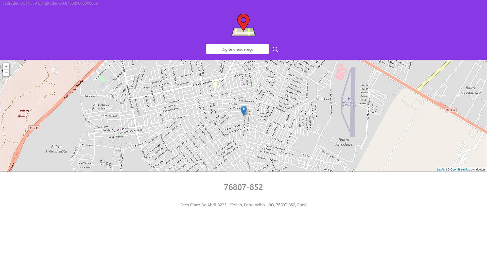

<article id="98c52289-ae58-49d4-88b6-758228b949d7" class="page sans">
		<header>
			
🗺️

			<h1 class="page-title">MeuCEP</h1>
		</header>
		

			
🗺️ Consiste em capturar a localização do dispositivo e
				fazer uma requisição a API Google Geocoding para obter CEP.

			

			

			

			

			
💻 Todas as chamadas a API são feitas na página, utilizando
				o <strong>Axios </strong>para realizar as requisições HTTP.

			
💻 O mapa utilizado é uma junção do <strong>Leaflet
				</strong>(que é uma biblioteca JavaScript open-source para mapas interativos) com o <strong>OpenStreet
					Maps</strong>.

			
💻 Utilizei a API de busca de imagens do Bing para exibir 5
				imagens da cidade capturada pela localização ou pesquisada.

			

			

			<figure id="1b18b603-795a-4903-ad45-6b8628649469" class="image"></figure>
			
🌐 Você pode acessar para ver o resultado em:

			<figure id="1471587f-0b76-48ce-b679-6c5c1fd4290a"><a href="https://viniciusrodrigues11.github.io/meucep/"
					class="bookmark source">
					

						

							

						

						
https://viniciusrodrigues11.github.io/meucep/

					

				</a></figure>
			

			

		

	</article>
